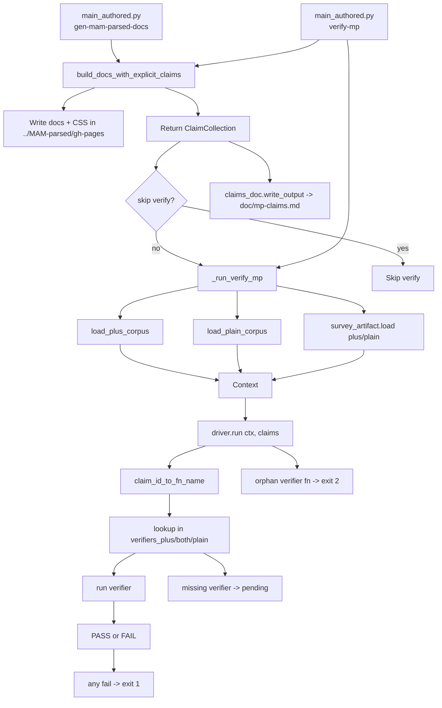

<!-- Initially generated by GitHub Copilot. -->
# MAM-parsed claims verification flow (current)

This write-up documents the current explicit-claims architecture used by:

- py/main_authored.py gen-mam-parsed-docs
- py/main_authored.py verify-mp
- py/main_authored.py gen-mp-claims-index

The primary source of truth is the current code in py/main_authored.py,
py/author/mam_parsed_docs_build.py, py/author_util/claim.py, and
py/verify_mp/.

## 1) MAM-parsed doc generation (current path)

Entry point: py/main_authored.py gen-mam-parsed-docs

Runtime flow:

1. cmd_gen_mam_parsed_docs() sets out_dir to ../MAM-parsed/gh-pages.
2. It calls author/mam_parsed_docs_build.py::build_docs_with_explicit_claims(out_dir).
3. build_docs_with_explicit_claims() creates a new ClaimCollection and then performs one traversal that:
   - emits shared claims via mp_cmn.emit_claims(claims=claims)
   - writes CSS via styles_mam_parsed.make_css_file_for_mam_parsed(...)
   - generates authored HTML docs via:
     - mpplain.gen_html_file(..., claims=claims)
     - mpplus.gen_html_file(..., claims=claims)
     - mpplus_aot.gen_html_file(..., claims=claims)
     - mpplus_kq_special.gen_html_file(..., claims=claims)
     - mpplus_haarah_2.gen_html_file(..., claims=claims)
     - mpplus_kaful.gen_html_file(..., claims=claims)
     - mpplus_good_ending.gen_html_file(..., claims=claims)
4. The function returns that same ClaimCollection instance.

Important behavior:

- Claims are assembled during the same traversal that writes authored docs.
- There is no separate claim-registration pass and no global registry lookup.
- gen-mam-parsed-docs runs verification by default. It skips verification only when --skip-verify-mp is provided.
- gen-mam-parsed-docs also writes doc/mp-claims.md via claims_doc.write_output(claims).

Outputs from this command:

- Authored HTML docs in ../MAM-parsed/gh-pages/
- CSS in ../MAM-parsed/gh-pages/style.css
- Claims index in doc/mp-claims.md

## 2) Claims verification (explicit claims, no global registry)

Entry points:

- py/main_authored.py verify-mp
- py/main_authored.py gen-mam-parsed-docs (unless --skip-verify-mp)

### 2.1 How claims enter verification

- verify-mp currently calls build_docs_with_explicit_claims("../MAM-parsed/gh-pages") and verifies those returned claims.
- gen-mam-parsed-docs passes its just-built ClaimCollection directly into verification.

In both cases, claims are explicit runtime objects (ClaimCollection), not implicit module-level state.

### 2.2 Data loading and context construction

_run_verify_mp(claims=...) in py/main_authored.py performs:

1. load_plus_corpus() from verify_mp/corpus.py (loads ../MAM-parsed/plus/*.json)
2. load_plain_corpus() from verify_mp/corpus.py (loads ../MAM-parsed/plain/*.json)
3. survey_artifact.load() (loads out/MAM-tmpl-survey/plus.json)
4. survey_artifact.load_plain() (loads out/MAM-tmpl-survey/plain.json)
5. Context(...) construction
6. verify_mp/driver.py::run(ctx, claims=claims)

### 2.3 Dispatch model and outcomes

In verify_mp/driver.py:

- claim_id_to_fn_name maps claim ids to verifier function names.
  - Example: mp.plus.verse.is-3-tuple -> verify_mp_plus_verse_is_3_tuple
- Verifier lookup order is fixed:
  - verify_mp/verifiers_plus.py
  - verify_mp/verifiers_both.py
  - verify_mp/verifiers_plain.py

For each claim id:

- If no verifier function is found, the claim is reported as pending.
- If a verifier function exists in the verifier modules but no matching claim id exists, this is an orphan verifier hard error and exits with status 2.
- Verifier assertion failures are collected as failures.
- After all claims run:
  - Any failed assertions -> exit status 1
  - Pending claims do not fail the run by themselves

## 3) Claims index generation

Entry point: py/main_authored.py gen-mp-claims-index

Runtime flow:

1. Rebuild claims via build_docs_with_explicit_claims("../MAM-parsed/gh-pages")
2. Generate and write markdown using verify_mp/claims_doc.py::write_output(claims)

claims_doc.py behavior:

- Builds doc/mp-claims.md from explicit claim records.
- Discovers verifier functions using the same claim-id-to-function convention and module order.
- Marks missing verifier functions as pending in the generated table.

## 4) Old vs new (brief)

Current model (new):

- Explicit ClaimCollection objects are created and threaded through authored builders via claims=...
- Claims are emitted by claims.claim(...)
- Verification consumes explicit claims provided at runtime

Removed legacy model:

- No module-level REGISTRY in author_util/claim.py
- No module-level claim(...) API in author_util/claim.py

Behavior is covered by py/tests/test_explicit_claims.py, including a test that asserts legacy globals are removed.

## 5) Compact flow diagram

## 6) Key code touchpoints

- py/main_authored.py
- py/author/mam_parsed_docs_build.py
- py/author_util/claim.py
- py/verify_mp/driver.py
- py/verify_mp/corpus.py
- py/verify_mp/survey_artifact.py
- py/verify_mp/verifiers_plus.py
- py/verify_mp/verifiers_both.py
- py/verify_mp/verifiers_plain.py
- py/verify_mp/claims_doc.py
- py/tests/test_explicit_claims.py
