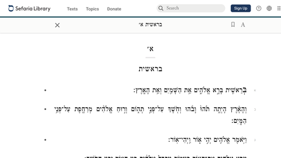
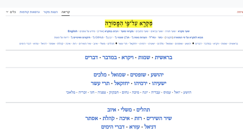
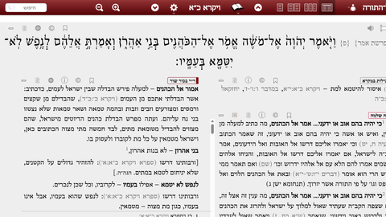
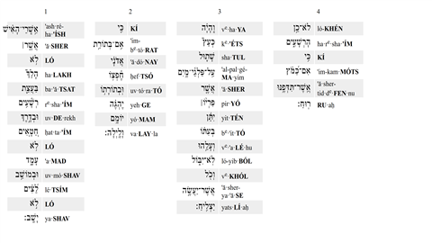

<!-- Initially generated by GitHub Copilot. -->

# What Is MAM?

Script for a narrated slideshow video.

| Image | Narration |
|-------|-----------|
|  | MAM stands for Miqra According to the Masorah. It is a Hebrew Bible dataset that has been used to create both paper books and websites. |
|  | It was used to create a recent JPS Psalms Commentary. |
|  | It was used to create various web editions of the Tanakh, like Sefaria's default Tanakh. |
|  | It was used to create the  Tanakh on Hebrew Wikisource. |
|  | And, it was used to create the Tanakh at the center of Al-Hatorah's Miqraot Gedolot. |
|  | With MAM at the base, and Al-Hatorah's work layered on top, it was then possible create a Phonetic Tanakh. |
