<!-- Initially generated by GitHub Copilot. -->

# MAM Is a Dataset

Script for a narrated slideshow video.

| Image | Narration |
|-------|-----------|
|  | This video is a follow-up to my video, "What is MAM?" I hope it will be one of many such follow-ups. What I'll talk about in this video is one of the trickiest things to understand about MAM, and that is that MAM is not an edition of the Hebrew Bible. Rather, it is a dataset that can be used to create editions of the Hebrew Bible. |
|  | For example, here's Psalm 5 verse 9 in five different editions created from the MAM dataset. Some of them format _ketiv/qere_ differently. Some of them include MAM's documentation notes. Some do not. Those that do include the notes display them in different ways. |
|  | MAM sometimes even presents editions with two or more versions of the same word. For example, in Psalm 15:1, there is a word with a _qamats_ that can be either _qatan_ or _gadol_, according to different sets of rules. MAM presents both, as you can see from the JSON encoding here. (I've shown the JSON with _qamats qatan_ upside down to make the distinction clearer.) Most editions choose one or the other, but some really weird editions may want to show both, like my "Phonetic Tanakh" does, as shown here! |
| 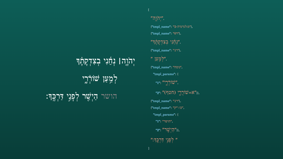 | Here's Psalm 5:9 again, with the contents of MAM shown as JSON on one side, and on the other side is the way one particular edition chooses to render that JSON. There's a lot of detail here, but the main point is that MAM is written in a kind of computer language called a markup language, and each edition is free to interpret that markup as it likes. Another way of putting it is that MAM is written in a language similar to HTML, and different editions can interpret MAM differently, similar to the way different CSS code can style HTML differently. It is important to note that the analogy to styling includes the usual somewhat superficial questions like color but also more substantive questions like whether an element is even shown or not! |
| 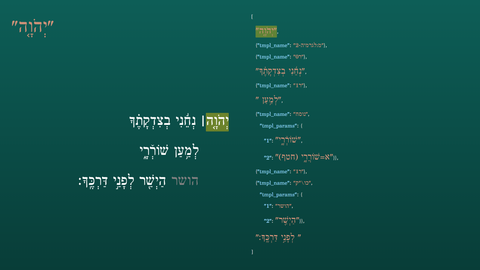 | Let's walk through this verse element by element. The first item highlighted is the simplest kind of thing in MAM's markup: a plain string of pointed Hebrew text. Here the string is the divine name accented with _mahapakh_ and pointed in a way that calls for its most common euphemism, ’ă·dó·NAY. You can see that same string highlighted in the rendered edition on the left. The majority of MAM's content is plain strings like this one. |
| 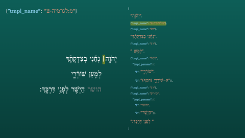 | Not everything is a plain string, though. This highlighted item is a template object that encodes the _legarmeh_ — the vertical bar that appears close to the preceding word in the rendered edition, as highlighted on the left. _Legarmeh_ and _paseq_ share the same Unicode character, but they have different functions in the text. By encoding it as a template, MAM lets each edition render the _legarmeh_ as it sees fit. In particular, many editions will want to render _legarmeh_ distinctly from _paseq_. |
| 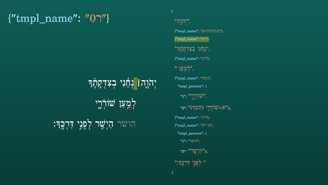 | Next is a _resh_-0 template. This is one of a family of poetry-layout templates that MAM uses, spanning _resh_-0 through _resh_-4. In the edition shown, _resh_-0 is just a non-breaking space. |
| 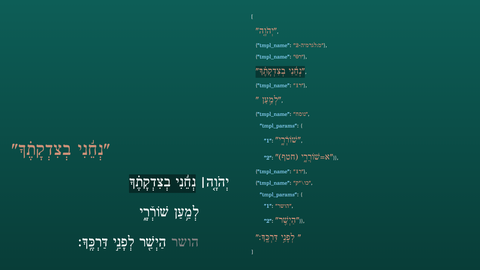 | Now we're back to a plain string: ne·ḤÉ·ní ve·tsid·ka·TE·kha. |
| 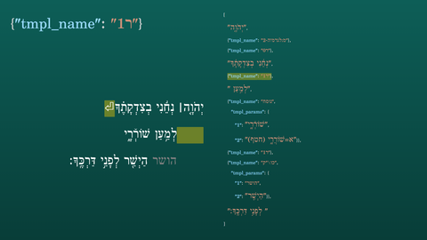 | Here's a _resh_-1 template. In this edition, it is interpreted as a line break followed by an indentation of the next line. On the left, I've shown a marker for the line break and I've highlighted both that marker and the indentation at the start of the next line. Many editions will just treat _resh_-1 as a plain word space. |
| 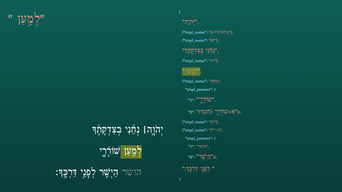 | Here we have another plain string: the word le·MA·‘an with a trailing space. |
| 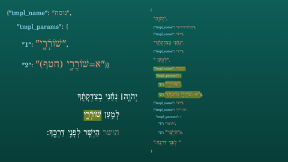 | Here we have a documentation-note template. Parameter 1 is the target of this note, i.e. what the note is about. In this case it is the word shó·re·RAY. We use (or, some would say, abuse) a _varika_ mark above the first _resh_ to mean "although we use a simple *shewa* below, a manuscript we care about uses a _ḥataf_ vowel here." Parameter 2, the doc-note itself, spells that out more clearly, stating that in the Aleppo Codex, the word has a _ḥataf pataḥ_. The edition rendered here does not show the note, but the note is encoded in the MAM data, available to any edition that wants to display it. |
| 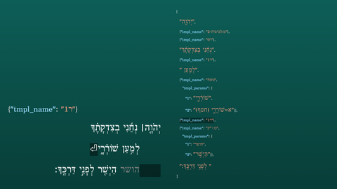 | Here's another _resh_-1 template: another poetry line break with an indent. |
| 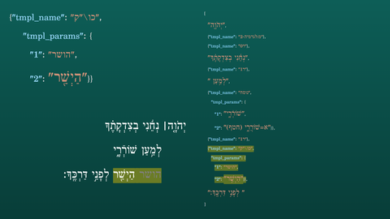 | This is the standard _ketiv/qere_ template. Parameter 1 is the unpointed _ketiv_. Parameter 2 is the pointed _qere_, hay·SHAR. In the rendered edition on the left, both appear together — the _ketiv_ in gray, the _qere_ in the normal text color. Different editions can choose to show only one, or show both in some other arrangement. |
| 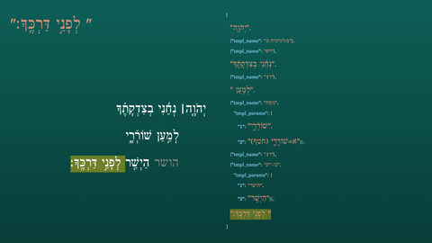 | The final element is a space and the closing words le·fa·NAY dar·KE·kha. The verse-end mark, _sof pasuq_, is part of this plain string — no separate template is needed for it. With that, we've walked through every element of the MAM encoding of Psalm 5:9 — a mix of plain strings carrying the Hebrew text, and named templates carrying structural and editorial information that each edition can interpret in its own way. |
