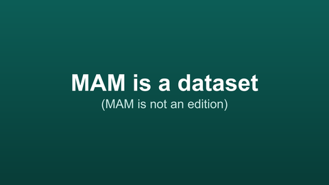
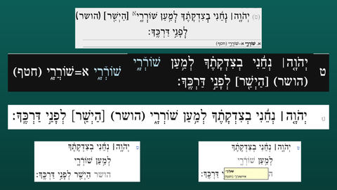
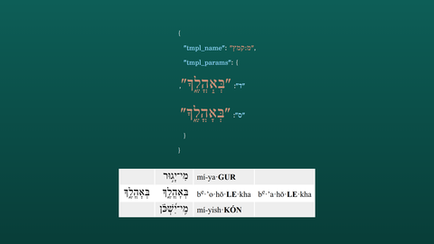

<!-- Initially generated by GitHub Copilot. -->

# MAM Is a Dataset

Script for a narrated slideshow video.

| Image | Narration |
|-------|-----------|
|  | This video is a follow-up to my video, "What is MAM?" I hope it will be one of many such follow-ups. One of the trickiest and most important things to understand about MAM is that it is not an edition of the Hebrew Bible. It is a dataset that can be used to create editions of the Hebrew Bible. |
|  | For example, here's Psalm 5 verse 9 in five different editions created from the MAM dataset. Some of them format ketiv/qere differently. Some of them include MAM's documentation notes. Some do not. Those that do include the notes display them in different ways. |
|  | MAM sometimes even presents editions with two or more versions of the same word. For example, there is a _qamats_ in this Psalm 15:1 word that can be either _qatan_ or _gadol_, according to different sets of rules. MAM presents both, as you can see from the JSON encoding here. (I've shown the JSON with _qamats qatan_ upside down to make the distinction clearer). Most editions choose one or the other, but some really weird editions may want to show both, like my "Phonetic Tanakh" does, as shown here! |
